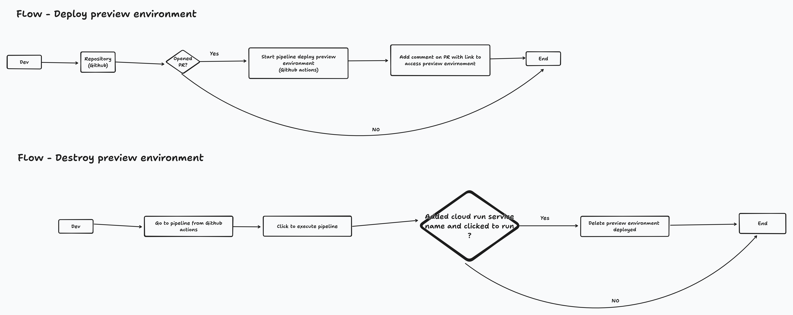

## About

- The proof of concept to automate process to create a preview environment when
  open the PR.

- The application is deployed on cloud run service.

## Technologies

- Api
  - Node.js
  - Javascript
- Devops/Cloud
  - Github actions
  - Terraform
  - Gcloud cli
  - Cloud run service

## Architecture



## Additional node

- You need to create 2 secrets in Github actions

```
    GCP_PROJECT // The project id where you find on GCP when you create your project
    GCP_SA_KEY // The service account json file enconded in base64
```
